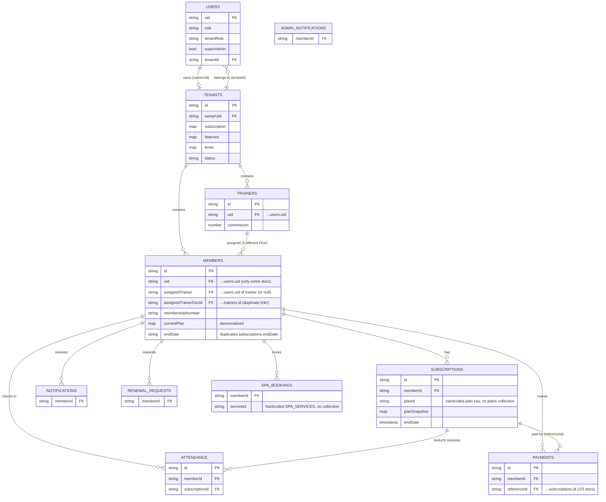

# PHASE 1 — Full System Inventory (GATE 1 Deliverable)

**System:** Power Time — Gym / Sports-Club Management SaaS (GR7)
**Audit branch:** `audit/deep-clean` · **DB backup:** `_db-backups/2026-07-02T15-18-35-536Z/`
**Date:** 2026-07-02 · **Status:** Read-only discovery — nothing changed.

---

## 1. Tech stack & environment

| Layer | Technology |
|---|---|
| Framework | Next.js 14.2 (App Router, JavaScript, `output: standalone`) |
| UI | React 18.3, framer-motion, Chart.js, CSS modules + inline styles |
| i18n | next-intl — locales `ar` (default) + `en` (`src/lib/i18n/messages/`; a stale duplicate `messages/` dir exists at repo root) |
| Auth | Firebase Auth (client SDK) + firebase-admin (API routes) |
| Database | **Firestore** — project `gr7-system` (single project = production; no staging) |
| Storage | Firebase Storage (rules in `storage.rules`) |
| Push | FCM (`public/firebase-messaging-sw.js`, VAPID key) |
| AI | Google Gemini via `@google/generative-ai` (with DEMO fallback mode when no API key) |
| Hosting | Firebase App Hosting (`apphosting.yaml`, Blaze plan, scale-to-zero) |
| Background jobs | **NONE** — no Cloud Functions, no cron, no scheduled tasks (see §9) |
| Tests | **NONE** — no test framework, no test script |

**Build baseline:** `npm run build` passes on `audit/deep-clean` (verified 2026-07-02).

---

## 2. Folder structure & entry points

```
src/
  middleware.js            i18n routing + cookie presence check (NOT a security boundary)
  app/[locale]/
    page.js                Public landing (hardcoded marketing)
    login|register|forgot-password|onboarding
    admin/        39 pages (gym owner/admin portal)
    client/       36 pages (member portal)
    trainer/      19 pages (trainer portal)
    super-admin/   7 pages (platform owner portal)
  app/api/
    admin/{onboarding,payments,seed,trainers}/route.js
    ai/{chat,nutrition,workout,usage}/route.js
  components/     FeatureGate, TrialBanner, UpgradePrompt, ExpiredScreen,
                  NotificationPopup, ai/* (4), layout/{Header,Sidebar}
  context/        TenantContext, ThemeContext
  lib/
    firebase/     config, firestore (generic+tenant CRUD helpers), auth, admin,
                  subscription (524 ln — plans/trial/payments), audit (UNUSED),
                  seed, messaging, storage-helpers
    ai/           ai-config, gemini, prompts, token-tracker
    hooks/        useAuth, useAI, useFeatureGate, useMemberData, useTrainerClients
    api-auth.js   Bearer-token verification for API routes
    rate-limiter.js  In-memory rate limiter (UNUSED — never imported)
Root: setAdmins.js (UTF-16, broken), setAdminsRaw.js, generate-secret-value.js,
      compress-images.js, service-account JSON (git-ignored), .env.local (git-ignored),
      "new fire base.txt" (console paste incl. VAPID private key — git-ignored),
      advanced_specifications.md, implementation_plan.md (design docs)
```

**Page reality check (169 total files, ~25.5K lines):**

| Portal | Pages | Real (Firestore-connected) | Mock/stub (no real data) |
|---|---|---|---|
| Admin | 39 | 35 | 4 (`ai-dashboard`, `insights`, `attendance/calendar`, `finance/invoices/[id]`) + 2 non-persisting (`ai-settings`, `backup`) |
| Client | 36 | 16 | **20 stubs** (workout, nutrition, achievements, challenges, leaderboard, streaks, records, sleep, recovery, exercises, workout-stats, goals, transformation, community, tracker, supplements, bookings/classes, bookings/spa, spa-booking, rate-trainer) |
| Trainer | 19 | 17 | 2 (`plan-builder`, `templates` — save/apply buttons do nothing) |
| Super-admin | 7 | 4 | 3 (`analytics` hardcoded; `plans` + `settings` don't persist edits) |

→ **~29 of 101 portal pages are UI shells** with no working backend.

---

## 3. Live database schema (from full backup, 32 docs)

**Root collections that actually exist: `tenants` (1), `users` (9).**
Root collections referenced by code/rules but **absent** in live DB: `plans`, `payments`, `platformSettings`, `auditLogs`, `aiUsage`.

### users/{uid} (9 docs)
`uid, email, role ('superadmin'|'admin'|'trainer'|'member'), tenantRole ('superadmin'|'owner'|'trainer'|'member'), superAdmin (bool), tenantId (string|null|missing), isActive, displayName*, phone*, avatar*, lang*, fcmTokens[]*, lastLogin*, createdAt, updatedAt*` (* = not on all docs)

### tenants/{tid} (1 doc)
`name, nameAr, nameEn, ownerEmail, ownerUid, phone, address (map), logo, status ('active'), subscription {plan:'quarterly', startDate, endDate, trialStartDate, trialEndDate, autoRenew, lastPaymentDate, nextPaymentDate}, features {13 flags — all true}, limits {maxMembers:500, maxTrainers:10}, createdAt, updatedAt`

### tenants/{tid} subcollections (only these 9 exist)

| Collection | Docs | Key fields |
|---|---|---|
| `members` | 2 | fullName {ar,en}, phone, email, gender, membershipNumber, qrCode, nationalId, status, planName, currentPlan (map), endDate (string!), joinDate, lastVisit, totalVisits, totalSpent, height, weight, bloodType, medicalNotes, assignedTrainer (uid|null), assignedTrainerDocId*, assignedTrainerName*, uid* (only 1/2 docs) |
| `subscriptions` | 2 | memberId, planId, planSnapshot, status, startDate, endDate, originalEndDate (ts), amountPaid, paymentMethod, autoRenew, freezeDaysUsed, maxFreezeDays, currentFreezeStart, freezeReason*, invitationsUsed, maxInvitations, totalSessions (null), remainingSessions (null), usedSessions, renewalReminded, createdBy, discountApplied |
| `payments` | 3 | memberId, memberName, amount, discount, netAmount, method, type, status, invoiceNumber* (1/3!), referenceId*, receivedBy*, notes* |
| `attendance` | 2 | memberId, memberName, checkIn (ts), checkOut (null), duration (null), method, gender, subscriptionId, subscriptionStatus, sessionDeducted |
| `trainers` | 1 | uid, name {ar,en}, email, phone, gender, specialization, commission, rating, monthlyEarnings, totalSessions, status |
| `notifications` | 9 | **two different shapes mixed**: member-notification {memberId, title, body, icon, read} vs broadcast {title, message, target, status, sentAt, senderId, senderName, readBy[]} |
| `admin-notifications` | 1 | type, title, body, icon, memberId, read |
| `renewal-requests` | 1 | memberId, memberName {ar,en}, memberPhone, membershipNumber, currentPlan, planType, price, status, requestedAt (string), rejectedAt (string) |
| `spa_bookings` | 1 | memberId, memberName, serviceId, serviceName, duration, price, scheduledTime (string), paymentMethod, status, notes |

---

## 4. Code-referenced collections vs live DB — the phantom matrix

**36 tenant-scoped collection names appear in code. Only 9 exist in the DB.**

### 4a. Naming-drift DUPLICATES (same concept, two spellings — data written by one page is invisible to the other)

| Concept | Variant A (writer) | Variant B (reader) | Rules name (3rd variant!) |
|---|---|---|---|
| Diet plans | `diet_plans` — trainer/diet-plans writes | `diet-plans` — client/diet + client/diet-plan read | `dietPlans` (rule never matches) |
| Training programs | `training_programs` — trainer/programs writes | `training-programs` — client/training reads | `trainingPrograms` (never matches) |
| Trainer sessions | `trainer_sessions` — trainer dashboard/analytics/schedule | `trainer-sessions` — trainer/planner | — |
| Attendance | `attendance` (real, admin scanner) | `checkins` (client/checkin — mood check-ins, different concept but confusable) | — |
| Audit trails | root `auditLogs` (lib/audit — UNUSED) | tenant `audit_logs` (admin/audit reads) + tenant `activity_log` (admin/activity reads) | `auditLogs` root rule |
| Body metrics | `measurements` (trainer/progress + client) | — | `bodyMetrics` (never matches) |
| Assessments | `assessments` (trainer/assessment reads) | `evaluations` (trainer/evaluation writes, assessment-form reads) | — |

→ **Member opens “My Diet Plan” and sees nothing, even after the trainer creates one** (writes go to `diet_plans`, reads come from `diet-plans`). Same break for training programs. Confirmed empty: neither variant exists in live DB.

### 4b. Phantom collections (referenced in code, zero data, feature never used or broken)
`activity_log, assessments, audit_logs, automations, campaigns, checkins, classes, config, contracts, diet-plans, diet_plans, employees, evaluations, expenses, feedback, guest-invitations, injuries, inventory, measurements, messages, offers, session-notes, shifts, trainer-sessions, trainer_sessions, training-programs, training_programs` — plus root `plans, payments, platformSettings, auditLogs, aiUsage`.

Note: phantom ≠ delete. Many are working features that simply have no data yet (e.g. `classes`, `expenses`). The naming-drift pairs and the three audit-log variants are the real defects.

---

## 5. Security rules vs reality (firestore.rules)

**Model:** role data lives in `users/{uid}` Firestore doc (NOT custom claims — all 9 Auth users have empty claims). Rules `get()` the user doc on every check. Storage rules, however, DO check custom claims (`request.auth.token.tenantId`) → **storage rules can never pass for normal users** (claims only set for trainers created via API `setCustomClaims`).

Key mismatches found (full audit in Phase 2):

1. **Dead specific rules:** `dietPlans`, `trainingPrograms`, `bodyMetrics` (camelCase) match no real collection → trainer-writable collections actually fall into the **generic catch-all**, which requires **admin** for create/update. Consequence: trainer writes to `diet_plans`/`training_programs`/`measurements`/`session-notes`/`evaluations`/`injuries`/`messages` should be **denied** for `tenantRole='trainer'` users (needs live verification — deployed rules may differ from repo).
2. **Members PII readable by every tenant member** (`members` allow read: belongsToTenant) — includes nationalId, phone, medicalNotes.
3. **Tenant owner can update own tenant doc without field restrictions** → can self-upgrade `subscription.plan`, `features`, `limits` for free.
4. **Tenant create is unvalidated** → any tenant-less authenticated user can create a tenant with arbitrary plan/features/status (onboarding writes trial, but rules don't enforce it).
5. `notifications` update allowed for any tenant member (can tamper others' notifications).
6. Root `payments` create allowed to any tenant member (not just owner).
7. `invoices` rule exists but no code writes invoices; `platformSettings` rule exists, only seed writes it.

---

## 6. Firestore indexes (firestore.indexes.json) — mostly phantom

| Index | Matches reality? |
|---|---|
| members: `membershipStatus`+`membershipEnd` | ❌ fields don't exist (real: `status`, `endDate`) |
| attendance: `memberId`+`checkInTime` | ❌ field is `checkIn` |
| finances: `type`+`date` | ❌ no `finances` collection anywhere |
| auditLogs ×3 | ❌ auditLogs never written (lib unused) |
| dietPlans / trainingPrograms (group) | ❌ camelCase names unused |
| classes: `isActive`+`schedule.dayOfWeek` | ❌ admin/classes queries only `createdAt` |
| payments, tenants, subscriptions, notifications, members(group) | ⚠️ plausible but most queries were simplified to single-field (commits removed compound queries) |

→ Essentially **the index file and the query layer have drifted apart completely**; recent fixes removed compound queries *because* indexes were missing, instead of adding indexes.

---

## 7. Roles & permissions model

| Role (`users.role` / `tenantRole`) | Portal | Guard |
|---|---|---|
| `superadmin` / `superAdmin: true` | /super-admin | Client-side layout check + rules `isSuperAdmin()`; also `SUPER_ADMIN_UID` env for seed API |
| `admin` / `owner` or `admin` | /admin | Client-side layout + rules `isTenantAdmin` |
| `trainer` / `trainer` | /trainer | Client-side layout (admins also allowed) + rules `isTenantTrainer` (mostly unused, see §5.1) |
| `member` / `member` | /client | Client-side layout + rules `belongsToTenant` |

- Middleware only checks cookie **presence**; every page is client-rendered — Firestore rules are the only real enforcement.
- Custom claims are set **only** for trainers created via `/api/admin/trainers` — inconsistent with rules that read Firestore docs, and with storage rules that read claims.
- 3 super-admin UIDs hardcoded in `setAdminsRaw.js` (git-tracked).

---

## 8. Plans, feature flags & limits

`PLAN_DEFINITIONS` (subscription.js): trial (90d free), monthly (500 EGP), quarterly (1200), semi_annual (2100), annual (3600) — each with `features` map (8 AI flags + spa/inventory/hr/analytics/sms) and `limits` (maxMembers, maxTrainers).

**Duplicated in 4 more places** (drift risk):
- `api/admin/onboarding/route.js` SERVER_PLAN_DEFS (hardcoded trial-only subset)
- `onboarding/page.js` local `planDefs`
- `register/page.js` hardcoded member plans (gold/diamond — a *different* concept: member subscription plans, unrelated to SaaS plans)
- Landing `page.js` hardcoded pricing display

Member-level plans (`members.currentPlan`, `subscriptions.planSnapshot`) are hardcoded in admin/members/new — the root `plans` collection and super-admin plans page are disconnected from them (and `plans` doesn't exist in the DB).

Feature gating: `FeatureGate` + `useFeatureGate` + `TenantContext.hasFeature` — reads `tenants.features`; enforced in UI only (rules never check features).

---

## 9. Background jobs & lifecycle enforcement — **missing subsystem**

The data model expects automation that does not exist anywhere:
- `subscriptions.renewalReminded` — nothing ever sets/uses it (no reminder job)
- `subscriptions.autoRenew` — nothing renews
- `tenants.subscription.endDate` — nothing expires tenants (expiry only computed client-side on page load; `expireTenant()` exported but never called)
- `attendance.checkOut/duration` — no checkout flow; always null
- specs doc (Flow 8) describes a Cloud Functions notification engine — never built

---

## 10. API surface (8 routes)

| Route | Auth | Rate-limit | Notes |
|---|---|---|---|
| POST /api/admin/onboarding | none (public by design) | ❌ | Creates Auth user + user doc + tenant (admin SDK); plan defs duplicated |
| POST/GET /api/admin/payments | Bearer + superAdmin | ❌ | Confirms/rejects root payments; activates tenant plan; no audit log |
| POST /api/admin/seed | Bearer + uid === SUPER_ADMIN_UID | ❌ | Seeds `plans`/`platformSettings`/super-admin user; callable in prod |
| POST /api/admin/trainers | Bearer + tenant owner/admin | ❌ | Creates trainer Auth user + doc + custom claims; no commission bounds |
| POST /api/ai/chat, nutrition, workout | Bearer | ✅ monthly budget (`aiUsage`) | Gemini + demo fallback; weak input validation; `role` trusted from client |
| GET/POST /api/ai/usage | Bearer (+role for upgrade) | ❌ | Upgrade/downgrade AI plan |

`lib/rate-limiter.js` exists but is imported by **nothing**.

---

## 11. ERD — current actual state (live collections, logical FKs)



No referential integrity is enforced anywhere (Firestore has no FKs; no server-side validation layer exists). Orphan risk on member delete: subscriptions/payments/attendance/messages keep dangling `memberId`s (admin/members delete only deletes the member doc).

---

## 12. Duplicate-logic hotspots (refactor candidates for Phase 2/3)

1. `PLAN_DEFINITIONS` ×5 locations (§8)
2. Timestamp→Date coercion (`ts?.toDate ? … : new Date(ts?.seconds…)`) — reimplemented in 20+ pages
3. Loading spinner JSX — copy-pasted in ~60 pages
4. Status-badge maps, date-range filters, locale formatting (`isAr ? 'ar-EG' : 'en-US'`) — per-page copies
5. Member lookup by `uid` then `userId` fallback — in useMemberData + subscription page + others
6. Client duplicate pages: `/client/diet` ≡ `/client/diet-plan`; `/client/bookings/spa` ≡ `/client/spa-booking`
7. Trainer client-list fetch (all members → client-side filter) ×5 pages, despite `useTrainerClients` hook existing

---

## 13. Access confirmed / not accessed

- ✅ Full code read access; ✅ Firestore read (Admin SDK); ✅ Firebase Auth list (9 users, no custom claims); ✅ full DB backup.
- ⚠️ Not verified: **deployed** Firestore rules & indexes (repo versions may differ from console). Verification requires `firebase login` or CI token — recommend checking in Phase 2.
- ⚠️ Storage bucket contents not inventoried (only rules reviewed).
